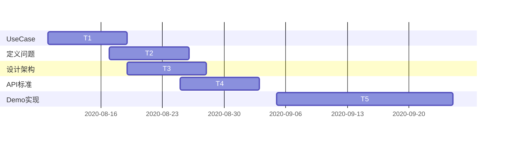

# BitcoinSV Wallet Connect 工作区

初衷:

- 实现BSV钱包和DAPP的接口标准

- 促进为BSV上面的Token，DEX，Defi等等DAPP应用发展

工具：

- 使用Github作为文档和编辑历史的保管

- 所有Markdown文档在电脑端使用[MarkText]([Releases · marktext/marktext · GitHub](https://github.com/marktext/marktext/releases))软件编辑

- 图表使用 [Mermaid](https://mermaid-js.github.io/mermaid/#/README) 方式的时序图、流程图和甘特图
  
  <mark>以下以及其他文档中的graph, gantt, sequenceDiagram均可在MarkText软件中展现为图形</mark>

工作流程：

贡献与提交:

* 在Issues中发帖讨论
- Fork此项目

- Clone获取代码
* 编辑md文件

* 提交md文件

* pull request，申请合并
