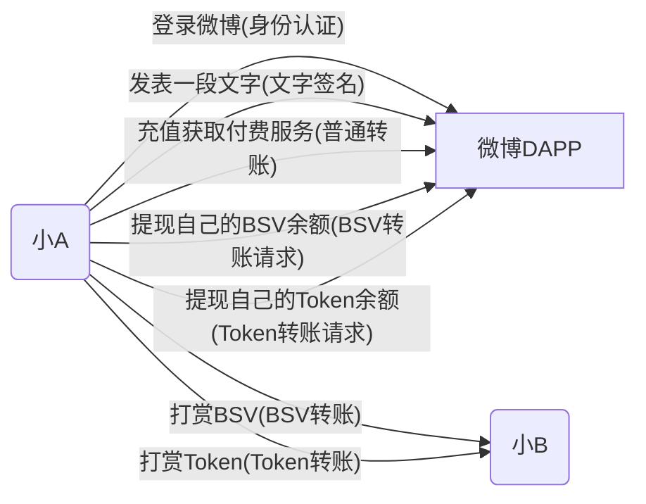
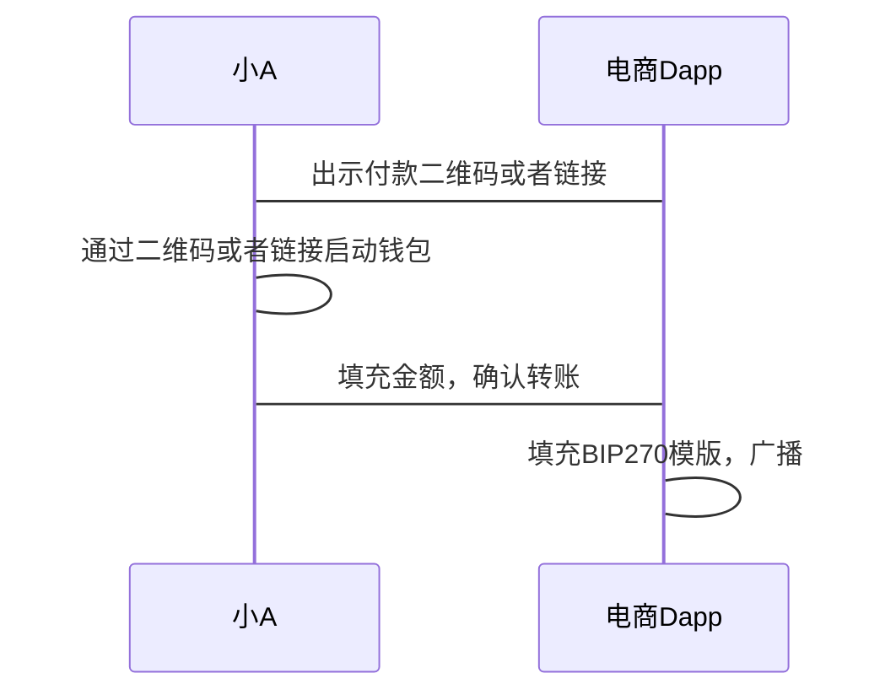
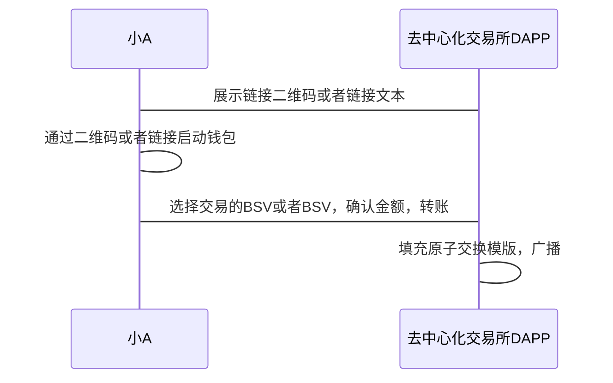

# Use Case

## 场景1

小A是普通用户，小B是另外一个普通用户，D是一个微博DAPP

```mermaid
graph LR
A(小A) -- "登录微博(身份认证)" --> D[微博DAPP]
A -- "发表一段文字(文字签名)" --> D
A -- "充值获取付费服务(普通转账)" --> D
A -- "打赏BSV(BSV转账)" --> B(小B)
A -- "打赏Token(Token转账)" --> B
A -- "提现自己的BSV余额(BSV转账请求)" --> D
A -- "提现自己的Token余额(Token转账请求)" --> D
```

## 场景2

小A是普通用户，小B是另外一个普通用户，D是一个电商DAPP

```mermaid
sequenceDiagram
participant A as 小A
participant D as 电商Dapp
D -> A:出示付款二维码或者链接
A -> A:通过二维码或者链接启动钱包
A -> D:填充金额，确认转账
D -> D:填充BIP270模版，广播
```

## 场景3

小A是普通用户，小B是另外一个普通用户，D是一个去中心化交易所DAPP

```mermaid
sequenceDiagram
participant A as 小A
participant D as 去中心化交易所DAPP
D -> A:展示链接二维码或者链接文本
A -> A:通过二维码或者链接启动钱包
A -> D:选择交易的BSV或者BSV，确认金额，转账
D -> D:填充原子交换模版，广播
```
